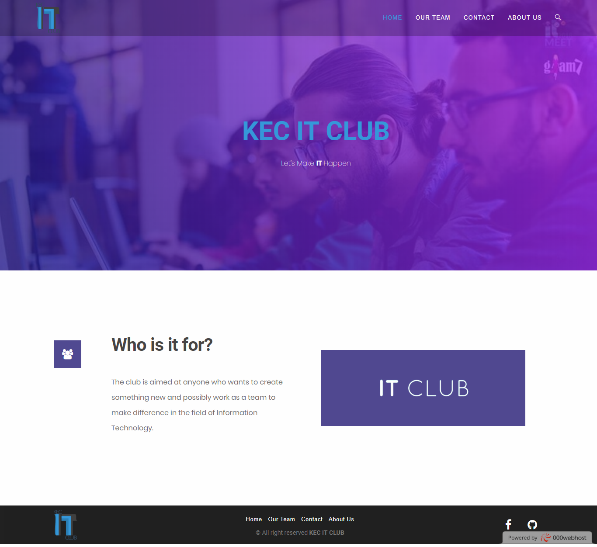

# Webpage
A practice site made using WordPress for KEC IT Club 

## Screenshots

## Development
Used WordPress 4.9.8-en_GB for developing the site on windows 10

### Theme
+ **OceanWP** *version 1.5.28*

### Plugins
+ **Elementor** *version 2.2.5* for creating post/pages/templates.
+ **Contact Form 7** *version 5.0.4* for creating contact form.
+ **Ocean Extra** *version 1.4.29* for managing different aspects of the webpage.

## License
This project is licensed under the MIT License - see the [LICENSE](LICENSE) file for details.
